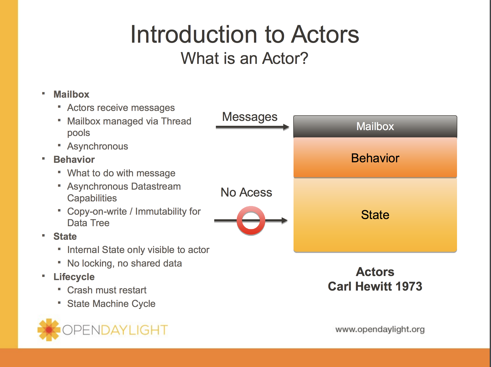
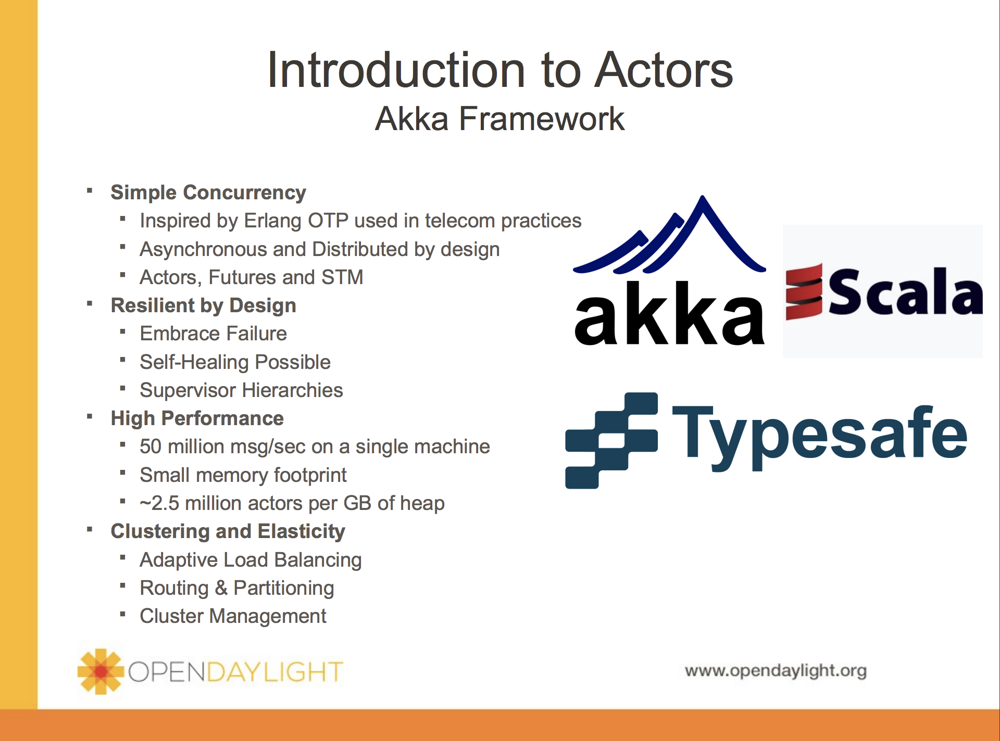
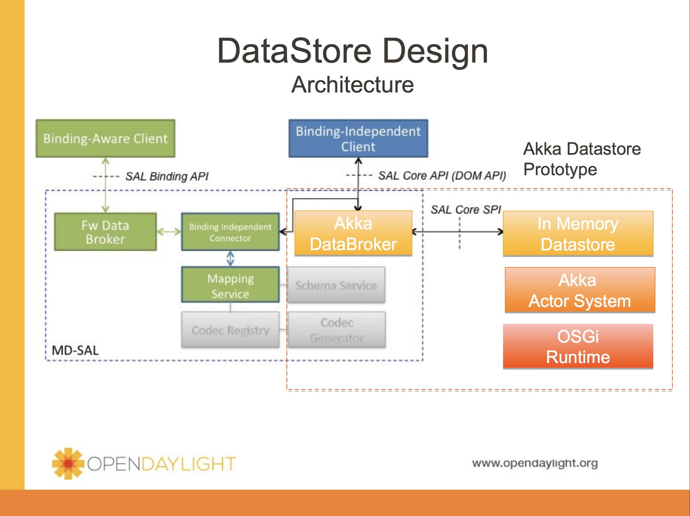

## What is Akka? ##

> Akka is an open-source toolkit and runtime simplifying the
> construction of concurrent and distributed applications on the JVM.
> Akka supports multiple programming models for concurrency, but it
> emphasizes actor-based concurrency, with inspiration drawn from
> Erlang.
> 
> Language bindings exist for both Java and Scala. Akka is written in
> Scala and, as of Scala 2.10, Akka's actor implementation is included
> as part of the Scala standard library.

[From wiki](https://en.wikipedia.org/wiki/Akka_(toolkit))

> Akka is a toolkit and runtime for building highly concurrent, distributed, and fault tolerant event-driven applications on the JVM.
Build powerful concurrent & distributed applications more easily.

[From Akka.io](http://akka.io/)

简单来说：
> akka是一个用scala编写的库，用于简化编写可容错的，可扩展的，高并发应用。akka使用actor模型来提升抽象能力，提供更好的平台来构建可扩展的，弹性的应用。对于比较难处理的错误，akka采用“let it crash”模型来处理，这种模式可以使得一个任务的处理失败不会导致整个应用的crash，使你的系统拥有强大的自愈能力，也不需要重启来恢复系统。同时akka的分布式部署更加简单透明。

----------
## Why Akka？##

> akka是一个可扩展性非常强的软件，这不仅不仅体现在性能上，而且还体现在它可适用的系统规模上。akka的核心包akka-actor非常小，对于已有的需要异步和无锁并发的系统而言，很容易就可以把akka融入进去。akka适用的前景非常广泛，可使用于金融系统，游戏，医疗，交通，仿真，数据分析等等场景，只要需要高吞吐量、低延迟的系统，akka就是一个可供选择的对象。

[From Akka docs](https://doc.akka.io/docs/akka/2.3.16/intro/why-akka.html)

---
## 基本概念 ##

### 角色
Akka中的角色
> * ProducerActor(StudentActor)
> * ConsumerActor(TeacherActor，onReceive方法接收消息)
> * ActorRef(tell方法，发送消息给MessageDispatcher消息派发器)
> * ActorSystem(actorOf方法，创建ActorRef，ActorRef就是ConsumerActor的Proxy)
> * MailBox
> * Dispatcher
> * Message

传送门：[Akka简介](http://ifeve.com/akka-notes-actor-messaging-1/)

## 关于集群 ##

### 1.Seed Nodes
>
>The seed nodes are configured contact points for new nodes joining the cluster. When a new node is started it sends a message to all seed nodes and then sends a join command to the seed node that answers first.

>The seed nodes configuration value does not have any influence on the running cluster itself, it is only relevant for new nodes joining the cluster as it helps them to find contact points to send the join command to; a new member can send this command to any current member of the cluster, not only to the seed nodes.

### FSM


#### 1.Member States
> * joining - transient state when joining a cluster

> * weakly up - transient state while network split (only if akka.cluster.allow-weakly-up-members=on)

> * up - normal operating state

> * leaving / exiting - states during graceful removal

> * down - marked as down (no longer part of cluster decisions)

> * removed - tombstone state (no longer a member)

#### 2.User Actions
> * join - join a single node to a cluster - can be explicit or automatic on startup if a node to join have been specified in the configuration

> * leave - tell a node to leave the cluster gracefully

> * down - mark a node as down

#### 3.Leader Actions
> * The leader has the following duties:

> * shifting members in and out of the cluster
> > joining -> up
> > 
> > exiting -> removed
 
[akka clustering](https://doc.akka.io/docs/akka/2.5.5/scala/common/cluster.html#failure-detector)

---
## 关于脑裂 ##
### What is Brain Split
>A fundamental problem in distributed systems is that network partitions (split brain scenarios) and machine crashes are indistinguishable for the observer, 
i.e. a node can observe that there is a problem with another node, but it cannot tell if it has crashed and will never be available again or 
if there is a network issue that might or might not heal again after a while. Temporary and permanent failures are indistinguishable because decisions must be made in finite time, 
and there always exists a temporary failure that lasts longer than the time limit for the decision.


脑裂常常发身在网络故障的时候，把一个分布式的系统，分成了至少2个partitions。 并且这两个partitions不能识别出到底谁才是正常的，因为集群需要再一个有限的短时间内做出一个判断，而网络的故障的时间是不定。
最终造成了整个集群处于一种不可用的状态。

### Split Brain Resolver strategy
所有策略的前提是，集群处于一个稳定的(stable)状态。 也就是说，在这个时间点，已经发生了脑裂，但是，不会有反复 (back and force )节点的 up/down。
基于这个前提，akka提供了一些策略，来应付脑裂的情况。
#### 1.Static Quorum
配置文件中，固定一个数值(static quorum) 当集群发生脑裂的时候，任何一个partition中的node >= 过这个值，则认定是有效的。
数值和集群有一关系 总节点数，必须小于 quorum-size * 2 - 1 ， 当然，也必须大于 quorum。

这个策略的有点是， 在任何脑裂发生的时候，当产生两个 partition的时候，效果是非常显著的， 因为必然会推举出一个 partition 有效。 另一个无效。
他的缺点是 :
a) quorum的数值是静态配置的，如果集群动态增加node，这个值必须随之而调整。
b） 如果partitions的数量超过2。 比如 10 Nodes，static quorum最小的值是6 ，如果发生脑裂时，将集群划分为3个partition，分别是 (3,3,4) ，那么任何partition都无法运作。

总的来说， Static Quorum相对简单粗放一些，可以应对大部分的异常，也有不少分布式系统使用的是这个策略， 比如 Elasticsearch。


#### 2.Keep Majority
基本规则是保留整个 partition中，拥有majority nodes的partition。
他和 static quorum相比的好处是， 如果整个 cluster 的nodes数量是动态调整的，那么majority也是一个动态的值，这样会避免 static quorum的问题。
但此策略依旧不能避免的是，如果两个 partitions所拥有的node数量是相同的，那么，整个 cluster 将会被终止。

此外，akka提供了基于 keep majority，额外的一个配置项：

```config
 akka.cluster.split-brain-resolver.keep-majority {
  # if the 'role' is defined the decision is based only on members with that 'role'
  role = ""
}
```
可以对于某些node定义他的价值，如果在多个partition中，拥有这些 valuable的节点数量较多的话，就会保留这个partition。
这个选项对于一个多角色的集群，某些node是无状态的(stateless)的工作节点，他们相对而言价值较低，而某些节点可能是数据持久化节点，或者是Master节点。
这样就可以区分出来多个Partition的价值，而保留价值高的部分。


#### 3.Keep Oldest
顾名思义，整个集群只保留一个拥有最老节点的partition
当然，有一个特例是，如果某一个partition，只有这一个oldest node，则这个partition会关闭它自己。
这个策略适用于一些 Singleton 的场景，即某些特殊的服务只存在于 oldest的节点上。

#### 4.Keep Referee
这个策略和 Keepr oldest类似，只是把 oldest节点替换成了 referee节点，referee节点可以是cluster中的任意一台。


[new features about aplit brain resolver in Akka 2.4](http://www.slideshare.net/Typesafe_Inc/akka-24-plus-commercial-features-in-typesafe-reactive-platform)

[Akka Commercial Addons](https://developer.lightbend.com/docs/akka-commercial-addons/current/)

---
## Using in OpenDaylight ##





----------
## 参考 ##
[[1] Akka框架基本要点介绍](http://shiyanjun.cn/archives/1168.html)

[[2] Akka doc](https://doc.akka.io/docs/akka/2.3.16/java.html)

[[3] Akka quick start](https://developer.lightbend.com/guides/akka-quickstart-java/)

[[4] Akka工作原理](https://birdben.github.io/2015/11/12/Others/Akka%E5%B7%A5%E4%BD%9C%E5%8E%9F%E7%90%86/)

[[5] MD-SAL Akka Prototype](https://wiki.opendaylight.org/images/2/2d/MD-SAL_Akka_Prototype.pdf)

[[6] Akka Cluster原理与应用](http://shiyanjun.cn/archives/1186.html)